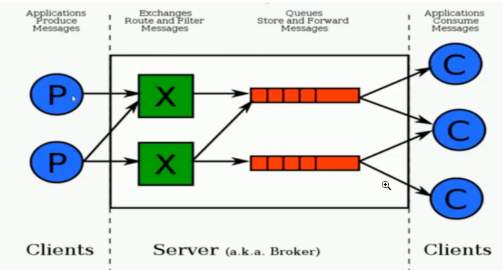

RabbitMQ

# 一、消息队列协议

- AMQP协议

  支持者：RabbitMQ、ActiveMQ

- MQTT协议

  支持者：RabbitMQ、ActiveMQ

- OpenMessage协议

  支持者：Apache RocketMQ

- Kafka协议

  支持者：kafka

# 二、消息队列持久化

## 1、持久化

简单来说就是将数据存入磁盘，而不是存在内存中随着服务器重启而消失，使数据能够永久保存


## 2、常见的持久化方式

|          | ActiveMQ | RabbitMQ | Kafka | RocketMQ |
| -------- | -------- | -------- | ----- | -------- |
| 文件存储 | 支持     | 支持     | 支持  | 支持     |
| 数据库   | 支持     | /        | /     | /        |

# 三、消息的分发策略

## 1、场景模型


## 2、消息分发策略的机制和对比

|          | ActiveMQ | RabbitMQ | Kafka | RocketMQ |
| -------- | -------- | -------- | ----- | -------- |
| 发布订阅 | 支持     | 支持     | 支持  | 支持     |
| 轮询分发 | 支持     | 支持     | 支持  | /        |
| 公平分发 | /        | 支持     | 支持  | /        |
| 重发     | 支持     | 支持     | /     | 支持     |
| 消息拉取 | /        | 支持     | 支持  | 支持     |

# 四、消息队列高可用和高可靠

## 1、高可用

所谓高可用是指产品在规定的条件和规定的时刻或时间内处于可执行规定功能状态的能力。

当业务量增加时，请求也过大，一台消息中间件服务器会触及硬件的极限，一台消息服务器已经无法满足业务需求，所以消息中间件必须支持集群部署来达到高可用的目的

## 2、集群模式1-Master-salve主从共享数据的部署模式


生产者将消息发送到Master节点，所有的都连接这个消息队列共享这块数据区域，Master节点负责写入，一旦Master挂掉，slave节点继续服务。从而形成高可用

## 3、集群模式2-Master-slave主从同步部署方式


这种模式写入消息同样在Master主节点上，但是主节点会同步数据到slave节点形成副本，和zookeeper或者redis主从机制很类同。这样可以达到负载均衡的效果，如果消费者有多个这样就可以去不同节点就行消费，消息的拷贝和同步会暂用很大的带宽和网络资源。在后续rabbitmq中会有使用

## 4、集群模式3-多主集群同步部署模式


和集群模式2差不多，但是它可以在任意节点中写入

## 5、集群模式4-多主集群转发部署模式


如果你插入的数据到broker1中，元数据信息会存储数据的相关描述和记录存放的位置。

它会对描述信息也就是元数据信息进行同步，如果消费者在broker2中进行消费，发现自己没有对应的信息，可以从对应的元数据信息去查询，然后返回对应的消息场景。

## 6、集群模式5-Master-slave与Broker-cluster组合的方案


> 总结：消息共享/消息同步/元数据共享	

# 五、RabbitMQ的入门及安装

> RabbitMQ是一个开源的遵循AMQP协议实现的基于Erlang语言编写，支持多种客户端。用于分布式系统中存储，转发消息，具有高可用，高可扩性，易用性等特征。

## 01、安装RabbitMQ

1：下载地址：https://www.rabbitmq.com/download.html


2：环境准备：CentOS7.x + / Erlang

RabbitMQ是采用Erlang语言开发的，所以系统环境必须提供Erlang环境，第一步就是安装Erlang

## 02、Erlang安装

地址:http://www.erlang-solutions.com/downloads/


- 选择CentOS

  

- 打开虚拟机，新建一个rabbitmq文件夹

  ```shell
  mkdir -p /usr/rabbitmq
  ```

- 将下载好的Rabbitmq和erlang放入该文件夹

- 安装Rabbitmq和erlang

  可能会出现错误

  ```shell
  错误：依赖检测失败：
  	libodbc.so.2()(64bit) 被 esl-erlang-23.2-1.x86_64 需要
  ```
  
  需要安装ODBC
  
  ```shell
  yum install unixODBC
  ```
  
  解压文件
  
  ```shell
  rpm -Uvh esl-erlang_23.2-1_centos_7_amd64.rpm
  ```
  
  安装
  
  ```shell
  yum install -y erlang
  ```
  
  查看版本号
  
  ```shell
  erl -v
  ```

## 03、安装socat

```shell
yum install -y socat
```

## 04、安装RabbitMQ

- 解压

  ```shell
  rpm -Uvh rabbitmq-server-3.8.16-1.el7.noarch.rpm
  ```

- 安装

  ```shell
  yum install rabbitmq -y
  ```

- 启动rabbitmq-server

  ```shell
  systemctl start rabbitmq-server
  ```

- 查看服务状态

  ```shell
  systemctl status rabbitmq-server
  ```

  有Active：active（running）表已启动

- 开机自动启动

  ```shell
  systemctl enable rabbitmq-server	#开启开机自动启动
  systemctl stop rabbitmq-server		#关闭开机自动启动
  ```

# 六、RabbitMQWeb管理界面及授权操作

## 01、RabbitMQ管理界面 

默认情况下，rabbitmq是没有安装web端的客户端插件，需要安装才可以生效

```shell
rabbitmq-plugins enable rabbitmq_management
```

安装完毕后，重启服务器

```shell
systemctl restart rabbitmq-server
```

进入虚拟机ip地址:15672(10.1.53.169:15672)


若无法进入，需要释放15672端口的防火墙

```shell
firewall-cmd --zone=public --add-port=15672/tcp --permanent
firewall-cmd --reload  #重启防火墙
```

rabbitmq有一个默认账号和密码：guest


默认情况只能在localhost本机下访问，所以需要添加一个远程登录的用户

## 02、授权账号和密码

### 02-1 新增用户

```shell
rabbitmqctl add_user admin admin
```

### 02-2 设置用户分配操作权限

```er
rabbitmqctl set_user_tags admin administrator
```

用户级别：

- adminstrator 可以登录控制台、查看所有信息、可以对rabbitmq进行管理
- monitoring 监控者 可以登录控制台、查看所有信息
- policymaker 策略制定者 登录控制台，指定策略
- managment 普通管理员，登录控制台

### 03 小结

```shell
rabbitmqctl add_user `账号` `密码` #添加用户
rabbitmqctl set_user_tags `账号` administrator #赋予角色
rabbitmqctl change_password `Username` `Newpassword` #修改密码
rabbitmqctl delete_user `Username` #删除用户
rabbitmqctl list_users #查看用户名单
rabbitmqctl set_permissions -p / `用户名` ".*" ".*" ".*" #为用户设置administrator角色
```


# 七、RabbitMQ之Docker安装

## 01、虚拟化容器技术—Docker的安装

```shell
#(1) yum包更新到最新
> yum update 
#(2) 安装需要的软件包，yum-util提供yum-config-manager功能，另外两个是devicemapper驱动依赖的
> yum install -y yum-utils device-mapper-persistent-data lvm2
#(3) 设置yum源为阿里云
> yum-config-manager --add-repo http://mirrors.aliyun.com/docker-ce/linux/centos/docker-ce.repo
#(4) 安装docker
> yum install docker-ce -y
#(5) 安装后查看docker版本
> docker -v
#(6) 启动docker
> systemctl start docker
#(7) 查看docker状态
> systemctl status docker
#(8)安装加速镜像
sudo mkdir -p /etc/docker
vim daemon.json
#在daemon.json中写入下面的数据
{
"registry-mirrors":["https://0wrdwnn6.mirror.aliyuns.com"]
}
#重启daemon和docker
sudo systemctl daemon-reload
sudo systemctl restart docker
#(9) 测试加速器设置成功
> docker run hello-world
```

## 02、docker的相关命令

```shell
#启动docker：
systemctl start docker
#停止docker
systemctl stop docker
#重启docker
systemctl restart docker
#查看docker状态
systemctl status docker
#开机启动
systemctl enable docker
systemctl unenable docker
#查看docker概要信息
docker info
#查看docker帮助文档
docker --help
```

## 03、安装RabbitMQ

### 03-1 获取rabbbit镜像

```shell
docker pull rabbbitmq:management
```

### 03-2 创建并运行容器

```shell
docker run -di --name=myrabbit -p 15672:15672 rabbitmq:management
```

—hostname：指定容器主机名称

—name：指定容器名称

-p：将mq端口号映射到本地

或者运行时设置用户和密码

**！只需执行下面这一步操作 无需执行上面那两步**

```shell
docker run -di --name myrabbit -e RABBITMQ_DEFAULT_USER=admin -e RABBITMQ_DEFAULT_PASS=admin -p 15672:15672 -p 5672:5672 -p 25672:25672 -p 61613:61613 -p 1883:1883 rabbitmq:management
```

```shell
#(1) 查看所有容器
docker ps -a
#(2) 查看所有镜像
docker images
#(3) 启动容器
docker start `CONTAINER ID`
#若端口启动不了 可尝试将已启动的rabbit-server关闭
systemctl stop rabbitmq-server
```

### 03-3 额外Linux相关排查命令

```shell
#查看端口是否被占用
netstat -naop | grep 5672 
#查看进程
ps -ef | grep 5672
```

# 八、RabbitMQ的角色分类

## 01、none

- 不能访问management plugin

## 02、mangement：查看自己相关的节点信息

- 列出自己可以通过AMQP登入的虚拟机
- 查看自己的虚拟机节点 virtual hosts的queues,exchanges和bindings信息
- 查看和关闭自己的channels和connections
- 查看有关自己的虚拟机节点virtual hosts的统计信息。包括其他用户在这个节点virtual hosts中的活动信息

## 03、Policymaker

- 包含management所有权限
- 查看和创建和删除自己的virtual hosts所属的policies和parameters信息

## 04、Monitorng

- 包含management所有权限
- 罗列出所有的virtual hosts，包括不能登录的virtual hosts
- 查看其他用户的connections和channels信息
- 查看节点级别的数据如clustering和memory使用情况
- 查看所有的virtual hosts的全局统计情况

## 05、Administrator

- 最高权限
- 可以创建和删除virtual hosts
- 可以查看，创建和删除users
- 查看创建permissions
- 关闭所有用户的connections

## 06、具体操作的界面 


# 九、RabbitMQ入门案例 - Simple 简单模式

RabbitMQ支持消息的模式：https://www.rabbitmq.com/getstarted.html


## 01、实现步骤

1. jdk1.8
2. 构建一个maven工程
3. 导入rabbitmq的maven依赖
4. 启动rabbitmq-server服务
5. 定义生产者
6. 定义消费者
7. 观察消息在rabbitmq-server服务中的过程

## 02、导入rabbitmq的maven依赖

### 02-1、Java原生依赖

```java
<dependency>
    <groupId>com.rabbitmq</groupId>
    <artifactId>amqp-client</artifactId>
    <version>5.12.0</version>
</dependency>
```

### 02-2、Spring依赖

```java
<dependency>
    <groupId>org.springframework.amqp</groupId>
    <artifactId>spring-amqp</artifactId>
    <version>2.3.7</version>
</dependency>

<dependency>
    <groupId>org.springframework.amqp</groupId>
    <artifactId>spring-rabbit</artifactId>
    <version>2.3.7</version>
</dependency>
```

### 02-3、Springboot依赖

```java
<dependency>
    <groupId>org.springframework.boot</groupId>
    <artifactId>spring-boot-starter-amqp</artifactId>
    <version>2.5.0</version>
</dependency>
```

## 03、Producer

```java
package com.geek.rabbitmq.simple;

import com.rabbitmq.client.Channel;
import com.rabbitmq.client.Connection;
import com.rabbitmq.client.ConnectionFactory;


/**
 * @ClassName Producer
 * @Description TODO
 * @Author Lambert
 * @Date 2021/5/25 11:10
 * @Version 1.0
 **/
public class Producer {
    public static void main(String[] args) {
        //所有的中间件技术都是基于tcp/ip协议基础之上构建新型的协议规范，只不过rabbitmq遵循的是amqp
        //ip  port


        //1:创建连接工厂
        ConnectionFactory connectionFactory = new ConnectionFactory();
        connectionFactory.setHost("10.1.53.169");
        connectionFactory.setPort(5672);
        connectionFactory.setUsername("admin");
        connectionFactory.setPassword("admin");
        connectionFactory.setVirtualHost("/");

        Connection connection = null;
        Channel channel = null;
        try {
            //2:创建连接Connection
            connection = connectionFactory.newConnection("生产者");
            //3:通过连接获取通道Channel
            channel = connection.createChannel();
            //4:通过通道创建交换机，声明队列，绑定关系，路由key，发送消息和接收消息
            String queueName = "queue1";
            /**
             * @params1 队列的名字
             * @params2 是否要持久化durable=false,所谓消息是否存盘,如果false是非持久化 true是持久化
             *          非持久化会存盘吗，会存盘，但是随着重启服务器会丢失。持久化时重启服务器队列仍存在
             * @params3 排他性，是否独占独立
             * @params4 是否自动删除，随着最后一个消费者消息消费完毕以后是否把队列删除
             * @params5 携带附属参数
             */
            channel.queueDeclare(queueName, false, false, false, null);
            //5:准备消息内容
            String message = "Hello RabbitMQ";
            //6:发送消息给队列queue
            /**
             * @params1:交换机
             * @params2:队列、路由key
             * @params3:消息状态控制
             * @params4:消息的内容
             * //面试题：可以存在没有交换机的队列吗？不可以，虽然没有指定交换机但是一定会有存在一个默认的交换机
             */
            channel.basicPublish("", queueName, null, message.getBytes());
            System.out.println("消息发送成功");
        } catch (Exception e) {
            e.printStackTrace();
        }finally {
            //7:关闭连接
            if(channel != null && channel.isOpen()){
                try {
                    channel.close();
                } catch (Exception e) {
                    e.printStackTrace();
                }
            }
            //8:关闭通道
            if(connection != null && connection.isOpen()){
                try {
                    connection.close();
                } catch (Exception e) {
                    e.printStackTrace();
                }
            }
        }

    }
}

```

## 04、Consumer

```java
package com.geek.rabbitmq.simple;

import com.rabbitmq.client.*;

import java.io.IOException;

/**
 * @ClassName Consumer
 * @Description TODO
 * @Author Lambert
 * @Date 2021/5/25 11:10
 * @Version 1.0
 **/
public class Consumer {
    public static void main(String[] args) {
        //所有的中间件技术都是基于tcp/ip协议基础之上构建新型的协议规范，只不过rabbitmq遵循的是amqp
        
        //1:创建连接工厂
        ConnectionFactory connectionFactory = new ConnectionFactory();
        connectionFactory.setHost("10.1.53.169");
        connectionFactory.setPort(5672);
        connectionFactory.setUsername("admin");
        connectionFactory.setPassword("admin");
        connectionFactory.setVirtualHost("/");

        Connection connection = null;
        Channel channel = null;
        try {
            //2:创建连接Connection
            connection = connectionFactory.newConnection("生产者");
            //3:通过连接获取通道Channel
            channel = connection.createChannel();
            //4:通过通道创建交换机，声明队列，绑定关系，路由key，发送消息和接收消息
            channel.basicConsume("queue1", true, new DeliverCallback() {
                public void handle(String s, Delivery message) throws IOException {
                    System.out.println("收到消息是：" + new String(message.getBody(), "UTF-8"));
                }
            }, new CancelCallback() {
                public void handle(String s) throws IOException {
                    System.out.println("接收消息失败");
                }
            });
            System.out.println("开始接收消息");
            //持续执行该块代码
            System.in.read();
        } catch (Exception e) {
            e.printStackTrace();
        }finally {
            //7:关闭连接
            if(channel != null && channel.isOpen()){
                try {
                    channel.close();
                } catch (Exception e) {
                    e.printStackTrace();
                }
            }
            //8:关闭通道
            if(connection != null && connection.isOpen()){
                try {
                    connection.close();
                } catch (Exception e) {
                    e.printStackTrace();
                }
            }
        }

    }
}

```

# 十、AMQP

## 01、AMQP的概念

AMQP全称：Advanced Message Queuing Protocol(高级消息队列协议)，是应用层协议的一个开发标准，为面向消息的中间件设计

## 02、AMQP生产者流转过程


## 03、AMQP消费者流转过程


# 十一、RabbitMQ的核心组成部分

## 01、RabbitMQ的核心组成部分


## 02、RabbitMQ整体架构




## 03、RabbitMQ的运转流程


## 04、RabbitMQ支持消息的模式

- 简单模式Simple
- 工作模式work
  - 类型：无
  - 特点：分发机制
- 发布订阅模式
  - 类型：fanout
  - 特点：Fanout一发布与定义模式，是一种广播机制，它是没有路由Key的模式
- 理由模式
  - 类型：direct
  - 特点：有routing-key的匹配模式
- 主题Topic模式
  - 类型：topic
  - 特点：模糊的routing-key的匹配模式
- 参数模式
  - 类型：headers
  - 参数匹配模式

## 05、RabbitWeb管理界面

获取队列信息


- Nack message requeue true：仅查看队列的信息，不消费
- Automatic ack：查看队列的信息并消费


向队列发送信息


# 十二、RabbitMQ入门案例 - Fanout模式


## 01、Web管理界面模拟操作

- 新建Fanout交换机

  

- 新建三条新的队列 queue1、queue2、queue3

  

- 进入刚才创建的fanout-exchange交换机，Bindings下绑定queue1、2、3

  

- 通过交换机的Publish message模块向绑定该交换机的队列推送消息

  

- 三条队列同时接收到消息

  


## 02、代码具体实现

- 类型：fanout
- 特点：fanout—发布与订阅模式，是一种广播机制，他没有理由key的模式

### 02-1、生产者

```java
package com.geek.rabbitmq.routing;

import com.rabbitmq.client.Channel;
import com.rabbitmq.client.Connection;
import com.rabbitmq.client.ConnectionFactory;


/**
 * @ClassName Producer
 * @Description TODO
 * @Author Lambert
 * @Date 2021/5/25 11:10
 * @Version 1.0
 **/
public class Producer {
    public static void main(String[] args) {

        //1:创建连接工厂
        ConnectionFactory connectionFactory = new ConnectionFactory();
        //2:设置连接属性
        connectionFactory.setHost("10.1.53.169");
        connectionFactory.setPort(5672);
        connectionFactory.setUsername("admin");
        connectionFactory.setPassword("admin");
        connectionFactory.setVirtualHost("/");

        Connection connection = null;
        Channel channel = null;
        try {
            //3:从连接工厂中获取连接
            connection = connectionFactory.newConnection("生产者");
            //4:通过连接获取通道Channel
            channel = connection.createChannel();
            //5:准备发送的消息内容
            String message = "Hello RabbitMQ";

            //6:准备交换机
            String exchangeName = "fanout-exchange";
            //7:定义路由key
            String routeKey = "";
            //8:指定交换机的类型
            String type = "fanout";

            //7:发送消息给中间件rabbitmq-server
            /**
             * @params1:交换机
             * @params2:队列、路由key
             * @params3:消息状态控制
             * @params4:消息的内容
             * //面试题：可以存在没有交换机的队列吗？不可以，虽然没有指定交换机但是一定会有存在一个默认的交换机
             */
            channel.basicPublish(exchangeName, routeKey, null, message.getBytes());
            System.out.println("消息发送成功");
        } catch (Exception e) {
            e.printStackTrace();
        }finally {
            //7:关闭连接
            if(channel != null && channel.isOpen()){
                try {
                    channel.close();
                } catch (Exception e) {
                    e.printStackTrace();
                }
            }
            //8:关闭通道
            if(connection != null && connection.isOpen()){
                try {
                    connection.close();
                } catch (Exception e) {
                    e.printStackTrace();
                }
            }
        }

    }
}
```


### 02-2、消费者（所有模式的消费者均相同）

```java
package com.geek.rabbitmq.routing;

import com.rabbitmq.client.*;

import java.io.IOException;

/**
 * @ClassName Consumer
 * @Description TODO
 * @Author Lambert
 * @Date 2021/5/25 11:10
 * @Version 1.0
 **/
public class Consumer {
    private static Runnable runnable = new Runnable() {
        public void run() {
            //1:创建连接工厂
            ConnectionFactory connectionFactory = new ConnectionFactory();
            //2:设置连接属性
            connectionFactory.setHost("10.1.53.169");
            connectionFactory.setPort(5672);
            connectionFactory.setUsername("admin");
            connectionFactory.setPassword("admin");
            connectionFactory.setVirtualHost("/");

            //获取队列的名称
            final String queueName = Thread.currentThread().getName();
            Connection connection = null;
            Channel channel = null;
            try {
                //3:从连接工厂中获取连接
                connection = connectionFactory.newConnection("生产者");
                //4:通过连接获取通道Channel
                channel = connection.createChannel();

                //5:定义接受信息的回调
                Channel finalChannel = channel;
                finalChannel.basicConsume(queueName, true, new DeliverCallback() {
                    public void handle(String s, Delivery delivery) throws IOException {
                        System.out.println(delivery.getEnvelope().getDeliveryTag());
                        System.out.println(queueName + "收到的消息是:"+new String(delivery.getBody(),"UTF-8"));
                    }
                }, new CancelCallback() {
                    public void handle(String s) throws IOException {

                    }
                });
                System.out.println("开始接收消息");
                System.in.read();
            } catch (Exception e) {
                e.printStackTrace();
            }finally {
                //7:关闭连接
                if(channel != null && channel.isOpen()){
                    try {
                        channel.close();
                    } catch (Exception e) {
                        e.printStackTrace();
                    }
                }
                //8:关闭通道
                if(connection != null && connection.isOpen()){
                    try {
                        connection.close();
                    } catch (Exception e) {
                        e.printStackTrace();
                    }
                }
            }
        }
    };

    public static void main(String[] args) {
        new Thread(runnable,"queue1").start();
        new Thread(runnable,"queue2").start();
        new Thread(runnable,"queue3").start();
    }
}
```


# 十三、RabbitMQ入门案例 - direct模式


## 01、Web管理界面模拟操作

- 新建direct交换机

  

- 进入direct_exchange，绑定队列与交换机的关系

  

- 向routing_key为email的发送信息

  

- queue1和queue3同时接收到消息

  

## 02、代码具体实现

### 02-1、生产者

> 同广播模式对比 只需修改交换机名字、类型并添加路由key

```java
package com.geek.rabbitmq.direct;

import com.rabbitmq.client.Channel;
import com.rabbitmq.client.Connection;
import com.rabbitmq.client.ConnectionFactory;


/**
 * @ClassName Producer
 * @Description TODO
 * @Author Lambert
 * @Date 2021/5/25 11:10
 * @Version 1.0
 **/
public class Producer {
    public static void main(String[] args) {
        //所有的中间件技术都是基于tcp/ip协议基础之上构建新型的协议规范，只不过rabbitmq遵循的是amqp
        //ip  port


        //1:创建连接工厂
        ConnectionFactory connectionFactory = new ConnectionFactory();
        //2:设置连接属性
        connectionFactory.setHost("10.1.53.169");
        connectionFactory.setPort(5672);
        connectionFactory.setUsername("admin");
        connectionFactory.setPassword("admin");
        connectionFactory.setVirtualHost("/");

        Connection connection = null;
        Channel channel = null;
        try {
            //3:从连接工厂中获取连接
            connection = connectionFactory.newConnection("生产者");
            //4:通过连接获取通道Channel
            channel = connection.createChannel();
            //5:准备发送的消息内容
            String message = "Hello direct_exchange";

            //6:准备交换机
            String exchangeName = "direct_exchange";
            //7:定义路由key
            String routeKey = "email";
            //8:指定交换机的类型
            String type = "direct";

            //7:发送消息给中间件rabbitmq-server
            /**
             * @params1:交换机
             * @params2:队列、路由key
             * @params3:消息状态控制
             * @params4:消息的内容
             * //面试题：可以存在没有交换机的队列吗？不可以，虽然没有指定交换机但是一定会有存在一个默认的交换机
             */
            channel.basicPublish(exchangeName, routeKey, null, message.getBytes());
            System.out.println("消息发送成功");
        } catch (Exception e) {
            e.printStackTrace();
        }finally {
            //7:关闭连接
            if(channel != null && channel.isOpen()){
                try {
                    channel.close();
                } catch (Exception e) {
                    e.printStackTrace();
                }
            }
            //8:关闭通道
            if(connection != null && connection.isOpen()){
                try {
                    connection.close();
                } catch (Exception e) {
                    e.printStackTrace();
                }
            }
        }

    }
}

```


# 十四、RabbitMQ入门案例 - Topics模式


## 01、Web管理界面模拟操作

- 新建topic交换机

  

- 进入topic_exchange，绑定队列与交换机的关系

  

  

  

  \# 代表后面可0级或多级 例如 com.xxxx.xxxx.xxxxx、com

  \*  只能有一级并且必须有一级

- 向队列发送消息

  | 接收队列               | routing_key            |                            |
  | ---------------------- | ---------------------- | -------------------------- |
  | queue1                 | com、com.xxxx.xxxx.xxx |                            |
  | queue1、queue2         | com.course.xxx         |                            |
  | queue1、queue2、queue3 | com.course.order       |                            |
  | queue4                 | user.xxxxx             |                            |
  | queue1、queue3、queue4 | com.course.user.order  | \*.courser.*前后只能有一级 |

  


## 02、代码具体实现

### 02-1、生产者

```java
```


# 十五、RabbitMQ入门案例 - Headers模式

通过参数来指定对应的队列

- 新建Headers_exchange

   

- 绑定队列

  

  

- 向queue1发送消息

  

- 接收成功

  

# 十六、完全的声明创建方式

> 这里以direct路由模式为例

## 01、生产者

```java
package com.geek.rabbitmq.all;

import com.rabbitmq.client.Channel;
import com.rabbitmq.client.Connection;
import com.rabbitmq.client.ConnectionFactory;


/**
 * @ClassName Producer
 * @Description TODO
 * @Author Lambert
 * @Date 2021/5/25 11:10
 * @Version 1.0
 **/
public class Producer {
    public static void main(String[] args) {
        //所有的中间件技术都是基于tcp/ip协议基础之上构建新型的协议规范，只不过rabbitmq遵循的是amqp
        //ip  port


        //1:创建连接工厂
        ConnectionFactory connectionFactory = new ConnectionFactory();
        //2:设置连接属性
        connectionFactory.setHost("10.1.53.169");
        connectionFactory.setPort(5672);
        connectionFactory.setUsername("admin");
        connectionFactory.setPassword("admin");
        connectionFactory.setVirtualHost("/");

        Connection connection = null;
        Channel channel = null;
        try {
            //3:从连接工厂中获取连接
            connection = connectionFactory.newConnection("生产者");
            //4:通过连接获取通道Channel
            channel = connection.createChannel();

            //5:准备交换机
            String exchangeName = "direct_message_exchange";
            //6:定义路由key
            String routeKey = "";
            //7:指定交换机的类型  direct/topic/fanout/headers
            String exchangeType = "direct";

            //8:声明交换机
            /**
             * @params1:交换机名字
             * @params2:交换机类型
             * @params3:是否持久化
             */
            channel.exchangeDeclare(exchangeName, exchangeType,true);

            //9:声明队列
            /**
             * @params1 队列的名字
             * @params2 是否要持久化durable=false,所谓消息是否存盘,如果false是非持久化 true是持久化
             *          非持久化会存盘吗，会存盘，但是随着重启服务器会丢失。持久化时重启服务器队列仍存在
             * @params3 排他性，是否独占独立
             * @params4 是否自动删除，随着最后一个消费者消息消费完毕以后是否把队列删除
             * @params5 携带附属参数
             */
            channel.queueDeclare("queue5", true, false, false, null);
            channel.queueDeclare("queue6", true, false, false, null);
            channel.queueDeclare("queue7", true, false, false, null);

            //10:绑定交换机与队列的关系
            channel.queueBind("queue5", exchangeName, "order");
            channel.queueBind("queue6", exchangeName, "order");
            channel.queueBind("queue7", exchangeName, "course");

            //11:准备发送的消息内容
            String message = "hello";

            //12:发送消息到交换机
            /**
             * @params1:交换机
             * @params2:队列、路由key
             * @params3:消息状态控制
             * @params4:消息的内容
             * //面试题：可以存在没有交换机的队列吗？不可以，虽然没有指定交换机但是一定会有存在一个默认的交换机
             */
            channel.basicPublish(exchangeName, "order", null, message.getBytes());
            System.out.println("消息发送成功");
        } catch (Exception e) {
            e.printStackTrace();
        }finally {
            //7:关闭连接
            if(channel != null && channel.isOpen()){
                try {
                    channel.close();
                } catch (Exception e) {
                    e.printStackTrace();
                }
            }
            //8:关闭通道
            if(connection != null && connection.isOpen()){
                try {
                    connection.close();
                } catch (Exception e) {
                    e.printStackTrace();
                }
            }
        }

    }
}
```

## 02、消费者

```java
package com.geek.rabbitmq.all;

import com.rabbitmq.client.*;

import java.io.IOException;

/**
 * @ClassName Consumer
 * @Description TODO
 * @Author Lambert
 * @Date 2021/5/25 11:10
 * @Version 1.0
 **/
public class Consumer {
    private static Runnable runnable = new Runnable() {
        public void run() {
            //1:创建连接工厂
            ConnectionFactory connectionFactory = new ConnectionFactory();
            //2:设置连接属性
            connectionFactory.setHost("10.1.53.169");
            connectionFactory.setPort(5672);
            connectionFactory.setUsername("admin");
            connectionFactory.setPassword("admin");
            connectionFactory.setVirtualHost("/");

            //获取队列的名称
            final String queueName = Thread.currentThread().getName();
            Connection connection = null;
            Channel channel = null;
            try {
                //3:从连接工厂中获取连接
                connection = connectionFactory.newConnection("生产者");
                //4:通过连接获取通道Channel
                channel = connection.createChannel();

                //5:定义接受信息的回调
                Channel finalChannel = channel;
                finalChannel.basicConsume(queueName, true, new DeliverCallback() {
                    public void handle(String s, Delivery delivery) throws IOException {
                        System.out.println(delivery.getEnvelope().getDeliveryTag());
                        System.out.println(queueName + "收到的消息是:"+new String(delivery.getBody(),"UTF-8"));
                    }
                }, new CancelCallback() {
                    public void handle(String s) throws IOException {

                    }
                });
                System.out.println("开始接收消息");
                System.in.read();
            } catch (Exception e) {
                e.printStackTrace();
            }finally {
                //7:关闭连接
                if(channel != null && channel.isOpen()){
                    try {
                        channel.close();
                    } catch (Exception e) {
                        e.printStackTrace();
                    }
                }
                //8:关闭通道
                if(connection != null && connection.isOpen()){
                    try {
                        connection.close();
                    } catch (Exception e) {
                        e.printStackTrace();
                    }
                }
            }
        }
    };

    public static void main(String[] args) {
        new Thread(runnable,"queue5").start();
        new Thread(runnable,"queue6").start();
        new Thread(runnable,"queue7").start();
    }
}
```

# 十七、RabbitMQ入门案例-Work模式

RabbitMQ支持消息的模式：https://www.rabbitmq.com/getstarted.html

## 01、Work模式轮询模式（Round-Robin）


当有多个消费者时，我们的消息会被哪个消费者消费呢，我们又该如何均衡消费者消费信息的多少呢？

主要有两种模式：

1. 轮询模式的分发：一个消费者一条，按均分发；
2. 公平分发：根据消费者的消费能力公平分发，处理快的处理得多，处理慢的处理的少；按劳分配；

### 01-1、轮询模式的特点

- 类型：无
- 特点：该模式接收消息是当有多个消费者接入时，消息的分配模式是一个消费者分配一条直至消息消费完成

### 01-2、生产者

```java
package com.geek.rabbitmq.work.lunxun;

import com.rabbitmq.client.Channel;
import com.rabbitmq.client.Connection;
import com.rabbitmq.client.ConnectionFactory;

import java.io.IOException;
import java.util.concurrent.TimeoutException;

/**
 * @ClassName Producer
 * @Description 简单模式（轮询）生产者
 * @Author Lambert
 * @Date 2021/6/1 14:20
 * @Version 1.0
 **/
public class Producer {
    public static void main(String[] args) {
        //1:创建连接工厂
        ConnectionFactory connectionFactory = new ConnectionFactory();
        //2:设置连接属性
        connectionFactory.setHost("10.1.53.169");
        connectionFactory.setPort(5672);
        connectionFactory.setUsername("admin");
        connectionFactory.setPassword("admin");
        connectionFactory.setVirtualHost("/");

        Connection connection = null;
        Channel channel = null;
        try {
            //3:从连接工厂中获取连接
            connection = connectionFactory.newConnection("生产者");
            //4:通过连接获取通道Channel
            channel = connection.createChannel();

            //5:准备发送消息的内容
            for (int i = 1; i <= 20; i++) {
                //消息的内容
                String msg = "消息" + i;
                //6:发送消息给交换机
                /**
                 * @params1:交换机 /   当该参数为""时 params2为队列名
                 * @params2:队列、路由key
                 * @params3:消息状态控制
                 * @params4:消息的内容
                 */
                channel.basicPublish("", "queue1", null, msg.getBytes());
                System.out.println("发送消息成功：消息"+i);
            }
        } catch (Exception e) {
            e.printStackTrace();
            System.out.println("发送消息出现异常");
        }finally {
            //6:释放连接关闭通道
            if(channel != null && channel.isOpen()){
                try {
                    channel.close();
                } catch (Exception e) {
                    e.printStackTrace();
                }
            }
            if(connection != null && connection.isOpen()){
                try {
                    connection.close();
                } catch (Exception e) {
                    e.printStackTrace();
                }
            }
        }

    }
}
```

### 01-3、消费者

> Work1

```java
package com.geek.rabbitmq.work.lunxun;

import com.rabbitmq.client.*;

import java.io.IOException;
import java.util.concurrent.TimeoutException;

/**
 * @ClassName Work1
 * @Description TODO
 * @Author Lambert
 * @Date 2021/6/1 14:31
 * @Version 1.0
 **/
public class Work1 {
    public static void main(String[] args) {
        //1:创建连接工厂
        ConnectionFactory connectionFactory = new ConnectionFactory();
        //2:设置连接属性
        connectionFactory.setHost("10.1.53.169");
        connectionFactory.setPort(5672);
        connectionFactory.setUsername("admin");
        connectionFactory.setPassword("admin");
        connectionFactory.setVirtualHost("/");

        Connection connection = null;
        Channel channel = null;

        try {
            //3:从连接工厂中获取连接
            connection = connectionFactory.newConnection("消费者-work1");
            //4:通过连接获取通道Channel
            channel = connection.createChannel();
            //5:定义接收消息的回调
            Channel finalChannel = channel;
//            finalChannel.basicQos(1);
            finalChannel.basicConsume("queue1", true, new DeliverCallback() {
                public void handle(String s, Delivery delivery) throws IOException {
                    System.out.println("work1-收到的消息是" + new String(delivery.getBody(),"UTF-8"));
                }
            }, new CancelCallback() {
                public void handle(String s) throws IOException {
                    System.out.println("work1-接收消息失败");
                }
            });
            System.out.println("work1-开始接收消息");
            System.in.read();
        } catch (Exception e) {
            e.printStackTrace();
        }finally {
            //7:关闭连接
            if(channel != null && channel.isOpen()){
                try {
                    channel.close();
                } catch (Exception e) {
                    e.printStackTrace();
                }
            }
            //8:关闭通道
            if(connection != null && connection.isOpen()){
                try {
                    connection.close();
                } catch (Exception e) {
                    e.printStackTrace();
                }
            }
        }
    }
}
```

> Work2

```java
package com.geek.rabbitmq.work.lunxun;

import com.rabbitmq.client.*;

import java.io.IOException;

/**
 * @ClassName Work2
 * @Description TODO
 * @Author Lambert
 * @Date 2021/6/1 14:32
 * @Version 1.0
 **/
public class Work2 {
    public static void main(String[] args) {
        //1:创建连接工厂
        ConnectionFactory connectionFactory = new ConnectionFactory();
        //2:设置连接属性
        connectionFactory.setHost("10.1.53.169");
        connectionFactory.setPort(5672);
        connectionFactory.setUsername("admin");
        connectionFactory.setPassword("admin");
        connectionFactory.setVirtualHost("/");

        Connection connection = null;
        Channel channel = null;

        try {
            //3:从连接工厂中获取连接
            connection = connectionFactory.newConnection("消费者-work2");
            //4:通过连接获取通道Channel
            channel = connection.createChannel();
            //5:定义接收消息的回调
            Channel finalChannel = channel;
//            finalChannel.basicQos(1);
            finalChannel.basicConsume("queue1", true, new DeliverCallback() {
                public void handle(String s, Delivery delivery) throws IOException {
                    System.out.println("work2-收到的消息是" + new String(delivery.getBody(),"UTF-8"));
                }
            }, new CancelCallback() {
                public void handle(String s) throws IOException {
                    System.out.println("work2-接收消息失败");
                }
            });
            System.out.println("work2-开始接收消息");
            System.in.read();
        } catch (Exception e) {
            e.printStackTrace();
        }finally {
            //7:关闭连接
            if(channel != null && channel.isOpen()){
                try {
                    channel.close();
                } catch (Exception e) {
                    e.printStackTrace();
                }
            }
            //8:关闭通道
            if(connection != null && connection.isOpen()){
                try {
                    connection.close();
                } catch (Exception e) {
                    e.printStackTrace();
                }
            }
        }
    }
}
```

启动Work1、Work2 生产者发送20条消息

由于是轮询模式 所以Work1和work2收到的消息数量是一样的

> Work1


> Work2


## 02、Work模式公平分发模式

### 02-1、生产者

```java
package com.geek.rabbitmq.work.fair;

import com.rabbitmq.client.Channel;
import com.rabbitmq.client.Connection;
import com.rabbitmq.client.ConnectionFactory;

/**
 * @ClassName Producer
 * @Description 简单模式（轮询）生产者
 * @Author Lambert
 * @Date 2021/6/1 14:20
 * @Version 1.0
 **/
public class Producer {
    public static void main(String[] args) {
        //1:创建连接工厂
        ConnectionFactory connectionFactory = new ConnectionFactory();
        //2:设置连接属性
        connectionFactory.setHost("10.1.53.169");
        connectionFactory.setPort(5672);
        connectionFactory.setUsername("admin");
        connectionFactory.setPassword("admin");
        connectionFactory.setVirtualHost("/");

        Connection connection = null;
        Channel channel = null;
        try {
            //3:从连接工厂中获取连接
            connection = connectionFactory.newConnection("生产者");
            //4:通过连接获取通道Channel
            channel = connection.createChannel();

            //5:准备发送消息的内容
            for (int i = 1; i <= 20; i++) {
                //消息的内容
                String msg = "消息" + i;
                //6:发送消息给交换机
                /**
                 * @params1:交换机 /   当该参数为""时 params2为队列名
                 * @params2:队列、路由key
                 * @params3:消息状态控制
                 * @params4:消息的内容
                 */
                channel.basicPublish("", "queue1", null, msg.getBytes());
                System.out.println("发送消息成功：消息"+i);
            }
        } catch (Exception e) {
            e.printStackTrace();
            System.out.println("发送消息出现异常");
        }finally {
            //6:释放连接关闭通道
            if(channel != null && channel.isOpen()){
                try {
                    channel.close();
                } catch (Exception e) {
                    e.printStackTrace();
                }
            }
            if(connection != null && connection.isOpen()){
                try {
                    connection.close();
                } catch (Exception e) {
                    e.printStackTrace();
                }
            }
        }

    }
}

```

### 02-2、消费者

> Work1

```java
package com.geek.rabbitmq.work.fair;

import com.rabbitmq.client.*;

import java.io.IOException;

/**
 * @ClassName Work1
 * @Description TODO
 * @Author Lambert
 * @Date 2021/6/1 14:31
 * @Version 1.0
 **/
public class Work1 {
    public static void main(String[] args) {
        //1:创建连接工厂
        ConnectionFactory connectionFactory = new ConnectionFactory();
        //2:设置连接属性
        connectionFactory.setHost("10.1.53.169");
        connectionFactory.setPort(5672);
        connectionFactory.setUsername("admin");
        connectionFactory.setPassword("admin");
        connectionFactory.setVirtualHost("/");

        Connection connection = null;
        Channel channel = null;

        try {
            //3:从连接工厂中获取连接
            connection = connectionFactory.newConnection("消费者-work1");
            //4:通过连接获取通道Channel
            channel = connection.createChannel();
            //5:定义接收消息的回调
            final Channel finalChannel = channel;
            //指标定义，qos=1指每次取多少条数据出来分给消费者，若为20某一消费者会一次性取20条，不定义时默认值为null是轮询分发
            finalChannel.basicQos(1);
            /**
             * @params1:队列名
             * @params2:true:自动应答(轮询模式)/false:手动应答(公平分发模式）
             */
            finalChannel.basicConsume("queue1", false, new DeliverCallback() {
                public void handle(String s, Delivery delivery) throws IOException {
                try {
                    System.out.println("work1-收到的消息是" + new String(delivery.getBody(),"UTF-8"));
                    Thread.sleep(1000);
                    //改成手动应答
                    finalChannel.basicAck(delivery.getEnvelope().getDeliveryTag(), false);
                } catch (InterruptedException e) {
                    e.printStackTrace();
                }
                }
            }, new CancelCallback() {
                public void handle(String s) throws IOException {
                    System.out.println("work1-接收消息失败");
                }
            });
            System.out.println("work1-开始接收消息");
            System.in.read();
        } catch (Exception e) {
            e.printStackTrace();
        }finally {
            //7:关闭连接
            if(channel != null && channel.isOpen()){
                try {
                    channel.close();
                } catch (Exception e) {
                    e.printStackTrace();
                }
            }
            //8:关闭通道
            if(connection != null && connection.isOpen()){
                try {
                    connection.close();
                } catch (Exception e) {
                    e.printStackTrace();
                }
            }
        }
    }
}
```

> Work2

```java
package com.geek.rabbitmq.work.fair;

import com.rabbitmq.client.*;

import java.io.IOException;

/**
 * @ClassName Work2
 * @Description TODO
 * @Author Lambert
 * @Date 2021/6/1 14:32
 * @Version 1.0
 **/
public class Work2 {
    public static void main(String[] args) {
        //1:创建连接工厂
        ConnectionFactory connectionFactory = new ConnectionFactory();
        //2:设置连接属性
        connectionFactory.setHost("10.1.53.169");
        connectionFactory.setPort(5672);
        connectionFactory.setUsername("admin");
        connectionFactory.setPassword("admin");
        connectionFactory.setVirtualHost("/");

        Connection connection = null;
        Channel channel = null;

        try {
            //3:从连接工厂中获取连接
            connection = connectionFactory.newConnection("消费者-work2");
            //4:通过连接获取通道Channel
            channel = connection.createChannel();
            //5:定义接收消息的回调
            final Channel finalChannel = channel;
            //公平分发需要启动
            //指标定义，qos=1指每次取多少条数据出来分给消费者，若为20某一消费者会一次性取20条，不定义时默认值为null是轮询分发
            finalChannel.basicQos(1);
            /**
             * @params1:队列名
             * @params2:true:自动应答(轮询模式)/false:手动应答(公平分发模式）
             */
            finalChannel.basicConsume("queue1", false, new DeliverCallback() {
                public void handle(String s, Delivery delivery) throws IOException {
                try {
                    System.out.println("work2-收到的消息是" + new String(delivery.getBody(),"UTF-8"));
                    Thread.sleep(200);
                    finalChannel.basicAck(delivery.getEnvelope().getDeliveryTag(),false);
                } catch (InterruptedException e) {
                    e.printStackTrace();
                }
                }
            }, new CancelCallback() {
                public void handle(String s) throws IOException {
                    System.out.println("work2-接收消息失败");
                }
            });
            System.out.println("work2-开始接收消息");
            System.in.read();
        } catch (Exception e) {
            e.printStackTrace();
        }finally {
            //7:关闭连接
            if(channel != null && channel.isOpen()){
                try {
                    channel.close();
                } catch (Exception e) {
                    e.printStackTrace();
                }
            }
            //8:关闭通道
            if(connection != null && connection.isOpen()){
                try {
                    connection.close();
                } catch (Exception e) {
                    e.printStackTrace();
                }
            }
        }
    }
}

```

启动Work1、Work2 生产者发送20条消息，由于Thread.sleep控制work2每200毫秒执行一次，work1每1000毫秒执行一次 所以work2会执行的更多一些


# 十八、RabbitMQ使用场景

## 01、解耦、削峰、异步

### 01-1、同步异步的问题（串行）

串行方式：将订单信息写入数据库成功后，发送注册邮件，再发送注册短信。以上三个任务全部完成后，返回给客户端。


```java
public void makeOrder(){
    //1:保存订单
    orderService.saveOrder();
    //2:发送短信服务
    messageService.sendSMS("order");
    //3:发送email服务
    emailService.sendEmail("order");
    //4:发送APP服务
   	appService.sendApp("order");
}
```

### 01-2 并行方式 异步线程池

并行方式：把订单信息写入数据库后，发送注册邮件的同时，发送注册短信。以上三个任务完成后，返回给客户端。与串行的差别是，并行的方式可以提高处理的时间


```java
public class Order {
    public void makeOrder(){
        //1:保存订单
        orderService.saveOrder();
        //相关发送
        relationMessage();
    }
    public void relationMessage(){
        //异步
        theadpool.submit(new Callable<Object>{
            public Object call(){
                //2:发送短信服务
                messageService.sendSMS("order");
            }
        })
    }
    public void relationMessage(){
        //异步
        theadpool.submit(new Callable<Object>{
            public Object call(){
                //3:发送email服务
                emailService.sendEmail("order");
            }
        })
    }
    public void relationMessage(){
        //异步
        theadpool.submit(new Callable<Object>{
            public Object call(){
                //4:发送APP服务
                appService.sendApp("order");
            }
        })
    }
}
```

存在问题：

- 耦合度高
- 需要自己写线程池 自己维护成本太高
- 出现了消息可能会丢失，需要自己做消息补偿
- 如何保证消息的可靠性要自己写
- 如果服务器承载不了，需要自己去写高可用

### 01-3、异步消息队列的方式


```java
public void makeOrder(){
    //1：保存订单
    orderService.saveOrder();
    rabbitTemplate.convertSend("ex","2","消息内容")
}
```

好处：

- 完全解耦，用MQ建立桥接
- 有独立的线程池和运行模型
- 出现了消息可能丢失，MQ有持久化功能
- 如果保证消息的可靠性，死信队列和消息转移等
- 如果服务器承载不了，需要自己去写高可用，HA镜像模型高可用

按照以上的约定，用户的响应时间相当于是订单信息写入数据库的时间，也就是50ms。注册邮件，发送短信写入消息队列后，直接返回，因此写入消息队列的速度很快，基本可以忽略，因此用户的响应时间可能是50毫秒。因此架构改变后，系统的吞吐量得到提高

## 02、高内聚 低耦合


## 03、流量的削峰


04、分布式事务的可靠消费和可靠生产

05、索引、缓存、静态化处理的数据同步

06、流量监控

07、日志监控

08、下单，订单分发，抢票

# 十九、RabbitMQ-Springboot案例-fanout模式

- 导入rabbitmq starter依赖

  ```java
  <dependency>
      <groupId>org.springframework.boot</groupId>
      <artifactId>spring-boot-starter-amqp</artifactId>
      <version>2.5.0</version>
  </dependency>
  ```

- 案例需求

  

## 01、生产者

创建工程springboot-order-rabbitmq-producer

- 修改配置文件application.properties

  ```properties
  server.port=8080
  
  spring.rabbitmq.username=admin
  spring.rabbitmq.password=admin
  spring.rabbitmq.virtual-host=/
  spring.rabbitmq.host=10.1.53.169
  spring.rabbitmq.port=5672
  ```

  无配置时默认账号密码都为guest

### 01-1、OrderService

```java
package com.geek.service;

import org.springframework.amqp.rabbit.core.RabbitTemplate;
import org.springframework.beans.factory.annotation.Autowired;
import org.springframework.stereotype.Service;

import java.util.UUID;

/**
 * @ClassName OrderService
 * @Description TODO
 * @Author Lambert
 * @Date 2021/6/2 9:15
 * @Version 1.0
 **/
@Service
public class OrderService {
    @Autowired
    private RabbitTemplate rabbitTemplate;

    /**
     * 模拟用户下单
     * @param userid
     * @param productid
     * @param num
     */
    public void makeOrder(String userid,String productid,Integer num){
        //1:根据商品id查询库存是否充足
        //2:保存订单
        String orderId = UUID.randomUUID().toString();
        System.out.println("订单生成成功：" + orderId);
        //3:通过MQ来完成消息的分发
        /**
         * @params1 交换机
         * @params2 路由key  若交换机值为""该参数为queue
         * @params3 消息内容
         */
        String exchangeName = "fanout_order_exchange";
        //fanout模式没有路由key
        String routingKey = "";
        rabbitTemplate.convertAndSend(exchangeName,routingKey,orderId);
    }
}
```

### 01-2、RabbitMqConfiguration

```java
package com.geek.config;

import org.springframework.amqp.core.Binding;
import org.springframework.amqp.core.BindingBuilder;
import org.springframework.amqp.core.FanoutExchange;
import org.springframework.amqp.core.Queue;
import org.springframework.context.annotation.Bean;
import org.springframework.context.annotation.Configuration;

/**
 * @ClassName RabbitMqConfiguration
 * @Description TODO
 * @Author Lambert
 * @Date 2021/6/2 9:29
 * @Version 1.0
 **/
@Configuration
public class RabbitMqConfiguration {
    //1:声明注册fanout模式的交换机
    @Bean
    public FanoutExchange fanoutExchange(){
        return new FanoutExchange("fanout_order_exchange",true,false);
    }
    //2:声明队列sms.fanout.queue,email.fanout.queue,duanxin.fanout.queue
    @Bean
    public Queue smsQueue(){
        return new Queue("sms.fanout.queue",true);
    }

    @Bean
    public Queue emailQueue(){
        return new Queue("email.fanout.queue",true);
    }

    @Bean
    public Queue duanxinQueue(){
        return new Queue("duanxin.fanout.queue",true);
    }
    //3:完成交换机和队列的绑定
    @Bean
    public Binding smsBinding(){
        return BindingBuilder.bind(smsQueue()).to(fanoutExchange());
    }
    @Bean
    public Binding emailBinding(){
        return BindingBuilder.bind(emailQueue()).to(fanoutExchange());
    }
    @Bean
    public Binding duanxinBinding(){
        return BindingBuilder.bind(duanxinQueue()).to(fanoutExchange());
    }
    
}
```

### 01-3、测试提交订单

```java
@Test
void contextLoads() {
    orderService.makeOrder("1","1",12);
}
```


交换机和队列绑定成功


三个队列收到订单编号：


## 02、消费者

创建工程springboot-order-rabbitmq-consumer

- 修改配置文件application.properties

  ```java
  server.port=8081
  
  spring.rabbitmq.username=admin
  spring.rabbitmq.password=admin
  spring.rabbitmq.virtual-host=/
  spring.rabbitmq.host=10.1.53.169
  spring.rabbitmq.port=5672
  ```

### 02-1、FanoutDuanxinConsumer

```java
package com.geek.service.fanout;

import org.springframework.amqp.rabbit.annotation.RabbitHandler;
import org.springframework.amqp.rabbit.annotation.RabbitListener;
import org.springframework.stereotype.Service;

/**
 * @ClassName FanoutDuanxinConsumer
 * @Description TODO
 * @Author Lambert
 * @Date 2021/6/2 11:15
 * @Version 1.0
 **/
@RabbitListener(queues = {"duanxin.fanout.queue"})
@Service
public class FanoutDuanxinConsumer {

    @RabbitHandler
    public void receiveMessage(String message){
        System.out.println("duanxin fanout——-接收到了订单信息是：" + message);
    }
}
```

### 02-2、FanoutEmailConsumer

```java
package com.geek.service.fanout;

import org.springframework.amqp.rabbit.annotation.RabbitHandler;
import org.springframework.amqp.rabbit.annotation.RabbitListener;
import org.springframework.stereotype.Service;

/**
 * @ClassName EmailConsumer
 * @Description TODO
 * @Author Lambert
 * @Date 2021/6/2 11:14
 * @Version 1.0
 **/
@RabbitListener(queues = "email.fanout.queue")
@Service
public class FanoutEmailConsumer {

    @RabbitHandler
    public void receiveMessage(String message){
        System.out.println("Email fanout——-接收到了订单信息是：" + message);
    }
}
```

### 02-3、FanoutSMSConsumer

```java
package com.geek.service.fanout;

import org.springframework.amqp.rabbit.annotation.RabbitHandler;
import org.springframework.amqp.rabbit.annotation.RabbitListener;
import org.springframework.stereotype.Service;

/**
 * @ClassName FanoutSMSConsumer
 * @Description TODO
 * @Author Lambert
 * @Date 2021/6/2 11:15
 * @Version 1.0
 **/
@RabbitListener(queues = "sms.fanout.queue")
@Service
public class FanoutSMSConsumer {
    @RabbitHandler
    public void receiveMessage(String message){
        System.out.println("SMS fanout——-接收到了订单信息是：" + message);
    }
}
```

### 02-4、测试消费

启动服务器 消费生产者向队列发送的订单编号


# 二十、RabbitMQ-Springboot案例-direct模式

## 01、生产者

### 01-1、DirectRabbitMqConfiguration

```java
package com.geek.config;

import org.springframework.amqp.core.Binding;
import org.springframework.amqp.core.BindingBuilder;
import org.springframework.amqp.core.DirectExchange;
import org.springframework.amqp.core.Queue;
import org.springframework.context.annotation.Bean;
import org.springframework.context.annotation.Configuration;

/**
 * @ClassName DirectRabbitMqConfiguration
 * @Description TODO
 * @Author Lambert
 * @Date 2021/6/2 14:04
 * @Version 1.0
 **/
@Configuration
public class DirectRabbitMqConfiguration {
    //1:声明注册direct模式的交换机
    @Bean
    public DirectExchange directExchange(){
        return new DirectExchange("direct_order_exchange");
    }

    //2:声明队列
    @Bean
    public Queue directDuanxinQueue(){
        return new Queue("duanxin.direct.queue",true);
    }
    @Bean
    public Queue directEmailQueue(){
        return new Queue("email.direct.queue",true);
    }
    @Bean
    public Queue directSmsQueue(){
        return new Queue("sms.direct.queue",true);
    }

    //3:绑定交换和队列的关系
    @Bean
    public Binding directDuanxinBinding(){
        return BindingBuilder.bind(directDuanxinQueue()).to(directExchange()).with("duanxin");
    }

    @Bean
    public Binding directEmailBinding(){
        return BindingBuilder.bind(directEmailQueue()).to(directExchange()).with("email");
    }

    @Bean
    public Binding directSmsBinding(){
        return BindingBuilder.bind(directSmsQueue()).to(directExchange()).with("sms");
    }
}

```

### 01-2、OrderService

```java
/**
     * 模拟用户下单
     * @param userid
     * @param productid
     * @param num
     */
public void makeOrderDirect(String userid,String productid,Integer num){
    //1:根据商品id查询库存是否充足
    //2:保存订单
    String orderId = UUID.randomUUID().toString();
    System.out.println("订单生成成功：" + orderId);
    //3:通过MQ来完成消息的分发
    /**
         * @params1 交换机
         * @params2 路由key  若交换机值为""该参数为queue
         * @params3 消息内容
         */
    String exchangeName = "direct_order_exchange";

    rabbitTemplate.convertAndSend(exchangeName,"email",orderId);
    rabbitTemplate.convertAndSend(exchangeName,"duanxin",orderId);
}
```

### 01-3、测试提交订单

```java
@Test
void test() {
    orderService.makeOrderDirect("2","2",10);
}
```


队列与交换机绑定情况


队列收到消息


## 02、消费者

### 02-1、DirectDuanxinConsumer

```java
package com.geek.service.direct;

import org.springframework.amqp.rabbit.annotation.RabbitHandler;
import org.springframework.amqp.rabbit.annotation.RabbitListener;
import org.springframework.stereotype.Component;
import org.springframework.stereotype.Service;

/**
 * @ClassName FanoutDuanxinConsumer
 * @Description TODO
 * @Author Lambert
 * @Date 2021/6/2 11:15
 * @Version 1.0
 **/
@RabbitListener(queues = {"duanxin.direct.queue"})
@Component
public class DirectDuanxinConsumer {

    @RabbitHandler
    public void receiveMessage(String message){
        System.out.println("duanxin direct——-接收到了订单信息是：" + message);
    }
}
```

### 02-2、DirectEmailConsumer

```java
package com.geek.service.direct;

import org.springframework.amqp.rabbit.annotation.RabbitHandler;
import org.springframework.amqp.rabbit.annotation.RabbitListener;
import org.springframework.stereotype.Component;
import org.springframework.stereotype.Service;

/**
 * @ClassName EmailConsumer
 * @Description TODO
 * @Author Lambert
 * @Date 2021/6/2 11:14
 * @Version 1.0
 **/
@RabbitListener(queues = "email.direct.queue")
@Component
public class DirectEmailConsumer {

    @RabbitHandler
    public void receiveMessage(String message){
        System.out.println("Email direct——-接收到了订单信息是：" + message);
    }
}
```

### 02-3、DirectSMSConsumer

```java
package com.geek.service.direct;

import org.springframework.amqp.rabbit.annotation.RabbitHandler;
import org.springframework.amqp.rabbit.annotation.RabbitListener;
import org.springframework.stereotype.Component;
import org.springframework.stereotype.Service;

/**
 * @ClassName FanoutSMSConsumer
 * @Description TODO
 * @Author Lambert
 * @Date 2021/6/2 11:15
 * @Version 1.0
 **/
@RabbitListener(queues = "sms.direct.queue")
@Component
public class DirectSMSConsumer {
    @RabbitHandler
    public void receiveMessage(String message){
        System.out.println("SMS direct——-接收到了订单信息是：" + message);
    }
}
```

### 02-4、测试消费

启动服务器，接收订单编号


# 二十一、RabbitMQ-Springboot案例-topic模式

这里使用注解完成声明交换机、队列和绑定交换机和队列的关系

## 01、生产者

### 01-1、OrderService

```java
/**
     * 模拟用户下单
     * @param userid
     * @param productid
     * @param num
     */
public void makeOrderTopic(String userid,String productid,Integer num){
    //1:根据商品id查询库存是否充足
    //2:保存订单
    String orderId = UUID.randomUUID().toString();
    System.out.println("订单生成成功：" + orderId);
    //3:通过MQ来完成消息的分发
    /**
         * @params1 交换机
         * @params2 路由key  若交换机值为""该参数为queue
         * @params3 消息内容
         */
    String exchangeName = "topic_order_exchange";
    /**
         * duanxin: #.duanxin.#
         * email:   *.email.#
         * sms:     com.#
         */
    String routingKey = "com.email.duanxin";
    rabbitTemplate.convertAndSend(exchangeName,routingKey,orderId);
}
```

## 02、消费者

### 02-1、TopicDuanxinConsumer

```java
package com.geek.service.topic;

import org.springframework.amqp.core.ExchangeTypes;
import org.springframework.amqp.rabbit.annotation.*;
import org.springframework.stereotype.Service;

/**
 * @ClassName FanoutDuanxinConsumer
 * @Description TODO
 * @Author Lambert
 * @Date 2021/6/2 11:15
 * @Version 1.0
 **/
@RabbitListener(bindings = @QueueBinding(
        value = @Queue(value = "duanxin.topic.queue",durable = "true",autoDelete = "false"),
        exchange = @Exchange(value = "topic_order_exchange",type = ExchangeTypes.TOPIC),
        key = "#.duanxin.#"
))
@Service
public class TopicDuanxinConsumer {
    @RabbitHandler
    public void receiveMessage(String message){
        System.out.println("duanxin topic——-接收到了订单信息是：" + message);
    }
}
```

### 02-2、TopicEmailConsumer

```java
package com.geek.service.topic;

import org.springframework.amqp.core.ExchangeTypes;
import org.springframework.amqp.rabbit.annotation.*;
import org.springframework.stereotype.Service;

/**
 * @ClassName EmailConsumer
 * @Description TODO
 * @Author Lambert
 * @Date 2021/6/2 11:14
 * @Version 1.0
 **/
@RabbitListener(bindings = @QueueBinding(
        value = @Queue(value = "email.topic.queue",durable = "true",autoDelete = "false"),
        exchange = @Exchange(value = "topic_order_exchange",type = ExchangeTypes.TOPIC),
        key = "*.email.#"
))
@Service
public class TopicEmailConsumer {

    @RabbitHandler
    public void receiveMessage(String message){
        System.out.println("Email topic——-接收到了订单信息是：" + message);
    }
}
```

### 02-3、TopicSMSComsumer

```java
package com.geek.service.topic;

import org.springframework.amqp.core.ExchangeTypes;
import org.springframework.amqp.rabbit.annotation.*;
import org.springframework.stereotype.Service;

/**
 * @ClassName FanoutSMSConsumer
 * @Description TODO
 * @Author Lambert
 * @Date 2021/6/2 11:15
 * @Version 1.0
 **/
@RabbitListener(bindings = @QueueBinding(
        value = @Queue(value = "sms.topic.queue",durable = "true",autoDelete = "false"),
        exchange = @Exchange(value = "topic_order_exchange",type = ExchangeTypes.TOPIC),
        key = "com.#"
))
@Service
public class TopicSMSConsumer {
    @RabbitHandler
    public void receiveMessage(String message){
        System.out.println("SMS topic——-接收到了订单信息是：" + message);
    }
}
```

### 02-4 测试

- 首先启动消费者服务

  

  可以发现交换机和队列绑定完毕

- 启动生产者发送订单编号

  ```java
  @Test
  void tests() {
      orderService.makeOrderTopic("3","3",8);
  }
  ```

  

- 同时消费者接收到订单编号并消费

  


# 二十二、RabbitMQ高级-过期时间TTL

## 01、概述

过期时间TTL表示可以对消息设置预期的时间，在这个时间内都可以被消费者接收获取，过了之后消息自动被删除。RabbitMQ可以对消息和队列设置TTL，目前有两种方法可以设置。

- 第一种方法是通过队列属性设置，队列中所有消息都有相同的过期时间
- 第二种方法是对消息进行单独设置，每条消息TTL可以不同

如果上述两种方法同时使用，则消息的过期时间以两者之间TTL最小的那个数值为准。消息在队列的生存时间一旦超过设置的TTL值，就称为dead message被投递到死信队列，消费者将无法再收到该消息

## 02、所有消息过期时间相同

### 02-1、生产者

#### 02-1-1、TTLRabbitMqConfiguration

```java
package com.geek.config;

import org.springframework.amqp.core.Binding;
import org.springframework.amqp.core.BindingBuilder;
import org.springframework.amqp.core.DirectExchange;
import org.springframework.amqp.core.Queue;
import org.springframework.context.annotation.Bean;
import org.springframework.context.annotation.Configuration;

import java.util.HashMap;
import java.util.Map;

/**
 * @ClassName TTLRabbitMqConfiguration
 * @Description TODO
 * @Author Lambert
 * @Date 2021/6/3 9:04
 * @Version 1.0
 **/
@Configuration
public class TTLRabbitMqConfiguration {
    //1:声明注册direct模式的交换机
    @Bean
    public DirectExchange ttlDirectExchange(){
        return new DirectExchange("ttl_direct_order_exchange");
    }
    //2:声明队列
    //  声明队列的过期时间
    @Bean
    public Queue ttlDirectSMSQueue(){
        //设置过期时间
        Map<String,Object> args = new HashMap<>();
        args.put("x-message-ttl", 5000);//时间必须是int类型  设置五秒钟后消息过期
        return new Queue("ttl.direct.queue",true,false,false,args);
    }

    //3:声明队列和交换机的绑定关系
    @Bean
    public Binding directsmsBinding(){
        return BindingBuilder.bind(ttlDirectSMSQueue()).to(ttlDirectExchange()).with("ttl");
    }
}
```

#### 02-1-2、OrderService

```java
/**
     * 模拟用户下单
     * @param userid
     * @param productid
     * @param num
     */
public void makeOrderDirectTtl(String userid,String productid,Integer num){
    //1:根据商品id查询库存是否充足
    //2:保存订单
    String orderId = UUID.randomUUID().toString();
    System.out.println("订单生成成功：" + orderId);
    //3:通过MQ来完成消息的分发
    /**
         * @params1 交换机
         * @params2 路由key  若交换机值为""该参数为queue
         * @params3 消息内容
         */
    String exchangeName = "ttl_direct_order_exchange";

    rabbitTemplate.convertAndSend(exchangeName,"ttl",orderId);
}
```

#### 02-1-3、测试TTL

```java
@Test
void testTtl(){
    orderService.makeOrderDirectTtl("4", "4", 6);
}
```

启动测试，该队列获取到消息


当5s后该消息过期


## 03、每条消息过期时间不同

### 03-1、生产者

#### 03-1-1、TTLRabbitMqConfiguration

```java
package com.geek.config;

import org.springframework.amqp.core.Binding;
import org.springframework.amqp.core.BindingBuilder;
import org.springframework.amqp.core.DirectExchange;
import org.springframework.amqp.core.Queue;
import org.springframework.context.annotation.Bean;
import org.springframework.context.annotation.Configuration;

import java.util.HashMap;
import java.util.Map;

/**
 * @ClassName TTLRabbitMqConfiguration
 * @Description TODO
 * @Author Lambert
 * @Date 2021/6/3 9:04
 * @Version 1.0
 **/
@Configuration
public class TTLRabbitMqConfiguration {
    //1:声明注册direct模式的交换机
    @Bean
    public DirectExchange ttlDirectExchange(){
        return new DirectExchange("ttl_direct_order_exchange");
    }
    //2:声明队列

    @Bean
    public Queue ttlDirectMessageQueue(){
        return new Queue("ttl.message.queue",true);
    }

    //3:声明队列和交换机的绑定关系
    @Bean
    public Binding directMessageBinding(){
        return BindingBuilder.bind(ttlDirectMessageQueue()).to(ttlDirectExchange()).with("ttlmessage");
    }
}

```


#### 03-1-2、OrderService

```java
/**
 * 模拟用户下单
 * @param userid
 * @param productid
 * @param num
 */
public void makeOrderDirectTtlMessage(String userid,String productid,Integer num){
    //1:根据商品id查询库存是否充足
    //2:保存订单
    String orderId = UUID.randomUUID().toString();
    System.out.println("订单生成成功：" + orderId);
    //3:通过MQ来完成消息的分发
    /**
     * @params1 交换机
     * @params2 路由key  若交换机值为""该参数为queue
     * @params3 消息内容
     */
    String exchangeName = "ttl_direct_order_exchange";
    String routingKey = "ttlmessage";
    //给消息设置过期时间
    MessagePostProcessor messagePostProcessor = message -> {
        message.getMessageProperties().setExpiration("5000");
        message.getMessageProperties().setContentEncoding("UTF-8");
        return message;
    };
    rabbitTemplate.convertAndSend(exchangeName,routingKey,orderId,messagePostProcessor);
}
```

#### 03-1-3、测试

```java
@Test
void testTTL2(){
    orderService.makeOrderDirectTtlMessage("5", "5", 4);
}
```

# 二十三、RabbitMQ高级-死信队列

## 01、概述

DLX，全称是Dead-Letter-Exchange，可以称之为**死信交换机**，也有人称之为死信邮箱。当消息在一个队列中变成死信(dead message)之后，它可能被重新发送到另一个交换机中，这个交换机就是DLX，绑定DLX的队列就称之为**死信队列**，消息变成死信，可能由于以下原因：

- 消息被拒绝
- 消息过期
- 队列达到最大长度

DLX也是一个正常的交换机，和一般的交换机没有区别，它能在任何的队列上被指定，实际上就是设置某一个队列的属性。当这个队列中存在死信，RabbitMQ就会自动地将这个消息重新发布到设置地DLX上去，进而被路由到另一个队列，即死信队列。

要想使用死信队列，只需要在定义队列的时候设置队列参数 `x-dead-letter-exchange`指定交换机即可


## 02、生产者

### 01-1、DeadRabbitMqConfiguration

```java
package com.geek.config;

import org.springframework.amqp.core.Binding;
import org.springframework.amqp.core.BindingBuilder;
import org.springframework.amqp.core.DirectExchange;
import org.springframework.amqp.core.Queue;
import org.springframework.context.annotation.Bean;
import org.springframework.context.annotation.Configuration;

/**
 * @ClassName DeadRabbitMqConfiguration
 * @Description TODO
 * @Author Lambert
 * @Date 2021/6/3 10:47
 * @Version 1.0
 **/
@Configuration
public class DeadRabbitMqConfiguration {
    //1:声明direct模式的死信交换机
    @Bean
    public DirectExchange deadDirectExchange(){
        return new DirectExchange("dead_direct_exchange");
    }

    //2:声明死信队列
    @Bean
    public Queue deadQueue(){
        return new Queue("dead.direct.queue",true);
    }
    //3:绑定死信队列与死信交换机
    @Bean
    public Binding deadBinding(){
        return BindingBuilder.bind(deadQueue()).to(deadDirectExchange()).with("dead");
    }
}
```

### 01-2、测试消息过期

向有TTL过期时间的队列发送消息

```java
@Test
void testTtl(){
    orderService.makeOrderDirectTtl("4", "4", 6);
}
```

5s前，TTL队列收到消息


5s后，消息没有被消费者消费，转存到死信队列


### 01-3、测试队列达到最大长度

在声明队列处注释过期时间

添加队列最大长度属性

```java
//args.put("x-message-ttl", 5000);//时间必须是int类型
args.put("x-max-length", 5);//队列最大长度为5
```

当向ttl.direct.queue队列发送7条消息时，第6条发送的时候会将第1条送往死信队列


第7条发送时会将第2条消息送往死信队列.....

# 二十四、RabbitMQ-内存磁盘的监控

## 01、RabbitMQ的内存警告

当内存使用超过配置的阈值或者磁盘空间对于配置的阈值时（低于50M），RabbitMQ会暂时阻塞客户端的连接，并且停止接收从客户端发来的消息，以此避免服务器的崩溃，客户端和服务端的心态检测机制也将失效，如下图 Connection全部挂起了


当出现blocking或者blocked说明到达了阈值和以及高负荷运行

## 02、RabbitMQ的内存控制

参考帮助文档：http://www.rabbitmq.com/configure.html

### 02-1、命令的方式

```shell
rabbitmqctl set_vm_memory_high_watermark absolute 50MB
#或者
rabbitmqctl set_vm_memory_high_watermark 0.4
```

absolute:绝对值 用MB GB KB表示

第二种是relative:相对值 0.4表示百分比

分析：

> rabbitmqctl set_vm_memory_high_watermark absolute 50MB


 Connection挂起了


### 02-2、配置文件方式 rabbitmq.conf

> 当前配置文件：/etc/rabbitmq/rabbitmq.conf

```shell
#默认
# vm_memory_high_watermark.relative = 0.4
# 使用relative相对值进行设置fraction,建以取值在0.4~0.7之间，不建议超过0.7
vm_memory_high_watermark.relative = 0.6
# 使用absolute的绝对值的方式,KB,MB,GB对应的命令如下
vm_memory_high_watermark.absolute = 2GB
```

## 03、RabbitMQ的内存换页

在某个Broker节点及内存阻塞生产者之前，它会尝试将队列中的消息换页到磁盘以释放内存空间，持久化和非持久化的消息都会写入磁盘中，其中持久化的消息本身就在磁盘有个副本，所以在转移的过程中持久化的消息会先从内存中清除掉。

> 默认的情况下，内存的阈值时50%时就会换页处理。
>
> 也就是说，在默认情况下该内存的阈值时0.4的情况下，当内存超过0.4*0.5=0.5时，就会进行换页动作

比如有1000MB的内存，当内存使用率达到400MB，以及达到了极限，但是因为配置的换页内存0.5，这个时候在达到极限400MB之前，会把内存中的200MB转移到磁盘中。从而达到稳健的运行

可以通过`vm_memory_high_watermark_paging_ratio`来进行调整

```shell
#rabbitmqctl set_vm_memory_high_watermark 0.4
vm_memory_high_watermark.relative = 0.4
#rabbitmqctl set_vm_memory_high_watermark_paging_ratio 0.7
vm_memory_high_watermark_paging_ratio = 0.7
```


## 04、RabbitMQ的磁盘预警

### 04-1、命令的方式

```shell
#当剩余的磁盘空间低于100GB时报红
rabbitmqctl set_disk_free_limit 100GB
```


# 二十五、RabbitMQ高级-集群

## 01、RabbitMQ集群

RabbitMQ这款消息队列中间件产品本身是基于Erlang编写，Erlang语言天生具备分布式特性（通过同步Erlang集群各节点的magic cookie来实现）。因此，RabbitMQ天然支持Clustering。这使得RabbitMQ本身不需要像ActiveMQ、Kafka那样通过ZooKeeper分别来实现HA方案和保存集群的元数据。集群是保证可靠性的一种方式，同时可以通过水平扩展以达到增加消息吞吐量能力的目的。

在实际使用过程中多采取多机多实例部署方式，为了便于练习搭建，有时候不得不在一台机器上去搭建一个rabbitmq集群。本章主要针对单机多实例这种方式来进行开展

> 主要参考官方文档：https://www.rabbitmq.com/clustering.html


## 02、集群搭建

配置的前提是rabbitmq可以运行起来，比如

```shell
ps aux|grep rabbitmq
```


可以看见相关进程，

```shell
systemctl status rabbitmq-server
```


关闭Rabbitmq服务

```shell
systemctl stop rabbitmq-server
```

## 03、单机多实例搭建

**场景：**假设有两个rabbitmq节点，分别为rabbit-1，rabbit-2，rabbit-1作为主节点，rabbit-2作为从节点。

**启动命令：**

```shell
RABBITMQ_NODE_PORT=5672 RABBITMQ_NODENAME=rabbit-1 rabbitmq-server -detached
```

**结束命令：**

```shell
rabbitmqctl -n rabbit-1 stop
```

### 03-1、启动第一个节点rabbit-1

```shell
sudo RABBITMQ_NODE_PORT=5672 RABBITMQ_NODENAME=rabbit-1 rabbitmq-server start &
```

至此节点rabbit-1启动完成

### 03-2、启动第二个节点rabbit-2

> 注意：web管理插件端口占用，所以还要指定其web插件占用的端口号

```shell
RABBITMQ_SERVER_START_ARGS="-rabbitmq_management listener [{port,15673}]"
```

```shell
sudo RABBITMQ_NODE_PORT=5673 RABBITMQ_SERVER_START_ARGS="-rabbitmq_management listener [{port,15673}]" RABBITMQ_NODENAME=rabbit-2 rabbitmq-server start &
```

### 03-3、验证启动成功

```shell
ps aux|grep rabbitmq
```

### 03-4、rabbit-1操作为主节点

```shell
# 停止应用
> sudo rabbitmqctl -n rabbit-1 stop_app
# 目的是清除节点上的历史数据（若不清楚，无法将节点加入到集群）
> sudo rabbitmqctl -n rabbit-1 reset
# 启动应用
> sudo rabbitmqctl -n rabbit-1 start_app
```

### 03-5、rabbit-2操作为从节点

```shell
# 停止应用
> sudo rabbitmqctl -n rabbit-2 stop_app
# 目的是清除节点上的历史数据（若不清楚，无法将节点加入到集群）
> sudo rabbitmqctl -n rabbit-2 reset
# 将rabbit-2节点加入到rabbit-1(主节点)集群当中【Server-node服务器的主机名】
> sudo rabbitmqctl -n rabbit-2 join_cluster rabbit-1@`Server-node` 
#如下
> sudo rabbitmqctl -n rabbit-2 join_cluster rabbit-1@localhost
# 启动应用
> sudo rabbitmqctl -n rabbit-2 start_app
```

单机时Server-node指：


多机时Server-node是主机ip

### 03-6、验证集群状态

```shell
> sudo rabbitmqctl cluster_status -n rabbit-1
Disk Nodes
rabbit-1@localhost
rabbit-2@localhost

Running Nodes
rabbit-1@localhost
rabbit-2@localhost
```

### 03-7、Web监控

> 注意在访问的时候：web界面的管理需要给15672 node-1和15673node-2 设置用户名和密码 

默认情况下，rabbitmq是没有安装web端的客户端插件，需要安装才可以生效

```shell
rabbitmq-plugins enable rabbitmq_management
```

开放防火墙

```shell
firewall-cmd --zone=public --add-port=15672/tcp --permanent
firewall-cmd --zone=public --add-port=15673/tcp --permanent
```

添加用户

```shell
rabbitmqctl -n rabbit-1 add_user admin admin
rabbitmqctl -n rabbit-1 set_user_tags admin administrator
rabbitmqctl -n rabbit-1 set_permissions -p / admin ".*" ".*" ".*"

rabbitmqctl -n rabbit-2 add_user admin2 admin2
rabbitmqctl -n rabbit-2 set_user_tags admin2 administrator
rabbitmqctl -n rabbit-2 set_permissions -p / admin2 ".*" ".*" ".*"
```

当主节点关闭后 从节点所有信息和功能都失效


### 03-8、小结

如果采用多机部署方式，需读取其中一个节点的cookie，并复制到其他节点（节点之间通过cookie确定相互是否可通信）cookie存放在/var/lib/rabbitmq/.erlang.cookie

例如：主机名分别为rabbit-1、rabbit-2

1. 逐个启动各节点

2. 配置各节点的hosts文件（vim /etc/hosts)

   ip1:rabbit-1

   ip2:rabbit-2

# 二十六、RabbitMQ高级-分布式事务

分布式事务是指事务操作位于不同的节点上，需要保证事务的AICD特性。

例如在下单场景，库存和订单如果不在同一个节点上，就设计分布式事务。

## 01、分布式事务的方式

在分布式系统中，要实现分布式事务，无外乎那几种解决方案

### 01-1、两阶段提交（2PC）需要数据库产商的支持，java组件有atomikos等

两阶段提交（2PC），通过引入协调者（Coordinator）来协调参与者的行为，并最终决定这些参与者是否要真正执行事务

### 01-2、补偿事务（TTC）

严选，阿里，蚂蚁金服

### 01-3、本地消息表（异步确保）

支付宝、微信支付主动查询支付状态，对账单的状态

### 01-4、MQ事务消息

## 02、具体实现

分布式事务的完整架构图：


美团外卖架构：


### 02-1、系统与系统之间的分布式事务问题


### 02-2、系统间调用中事务的回滚问题

创建两个项目模块`geek-order-service`和`geek-dispatch-service`

#### 1、geek-order-service

- application.yml

  ```yaml
  server:
    port: 8089
  
  spring:
    datasource:
      username: root
      password: 123456
      url: jdbc:mysql://localhost:3306/demo
      driver-class-name: com.mysql.cj.jdbc.Driver
    jpa:
      show-sql: true
      open-in-view: true
      hibernate:
        ddl-auto: update
    rabbitmq:
      addresses: 192.168.247.128:5672,192.168.247.128:5673
      username: admin
      password: admin
      virtual-host: /
      # 开启手动ACK，让程序去控制MQ消息的重发、移除和转移
      publisher-confirm-type: correlated
      publisher-returns: true
      listener:
        simple:
          acknowledge-mode: manual
          retry:
            enabled: true #开启重启
            max-attempts: 10 #最大重试次数
            initial-interval: 2000ms #重试间隔时间
  ```

- 引入依赖

  ```xml
  <dependency>
      <groupId>org.springframework.boot</groupId>
      <artifactId>spring-boot-starter-amqp</artifactId>
  </dependency>
  <dependency>
      <groupId>org.springframework.boot</groupId>
      <artifactId>spring-boot-starter-data-jdbc</artifactId>
  </dependency>
  <dependency>
      <groupId>org.springframework.boot</groupId>
      <artifactId>spring-boot-starter-web</artifactId>
  </dependency>
  
  <dependency>
      <groupId>org.springframework.boot</groupId>
      <artifactId>spring-boot-devtools</artifactId>
      <scope>runtime</scope>
      <optional>true</optional>
  </dependency>
  <dependency>
      <groupId>mysql</groupId>
      <artifactId>mysql-connector-java</artifactId>
      <scope>runtime</scope>
  </dependency>
  <dependency>
      <groupId>org.projectlombok</groupId>
      <artifactId>lombok</artifactId>
      <optional>true</optional>
  </dependency>
  <dependency>
      <groupId>org.springframework.boot</groupId>
      <artifactId>spring-boot-starter-test</artifactId>
      <scope>test</scope>
  </dependency>
  <dependency>
      <groupId>org.springframework.amqp</groupId>
      <artifactId>spring-rabbit-test</artifactId>
      <scope>test</scope>
  </dependency>
  <!-- https://mvnrepository.com/artifact/com.fasterxml.jackson.dataformat/jackson-dataformat-avro -->
  <dependency>
      <groupId>com.fasterxml.jackson.dataformat</groupId>
      <artifactId>jackson-dataformat-avro</artifactId>
      <version>2.12.3</version>
  </dependency>
  
  <dependency>
      <groupId>org.apache.commons</groupId>
      <artifactId>commons-lang3</artifactId>
  </dependency>
  <dependency>
      <groupId>org.springframework.boot</groupId>
      <artifactId>spring-boot-starter-data-jpa</artifactId>
  </dependency>
  <dependency>
      <groupId>org.springframework.boot</groupId>
      <artifactId>spring-boot-starter-data-jpa</artifactId>
  </dependency>
  ```

- 实体类Order

  ```java
  @Data
  @Entity
  @AllArgsConstructor
  @NoArgsConstructor
  @Table(name = "`order`")
  public class Order {
  
      @Id
      private String id;
      private Integer userId;
      private String orderContent;
      private LocalDateTime createTime;
  }
  ```

- 持久层OrderRepository

  ```java
  public interface OrderRepository extends JpaRepository<Order, String> {
  }
  ```

- 业务层OrderService

  ```java
  @Service
  public class OrderService {
  
      @Autowired
      private OrderRepository orderRepository;
  
      @Transactional(rollbackFor = Exception.class)
      public void create(Order order) throws Exception {
          // 1.订单信息----插入订单数据库，订单数据库事务
          orderRepository.save(order);
  
          // 2.通过http接口发送订单消息到运单系统
          String result = dispatchHttpApi(order.getId());
          if (!"success".equals(result)) {
              throw new Exception("订单创建失败，原因是运单接口调用失败！");
          }
      }
  
      /**
       * 将订单信息发送到运单系统
       * @param orderId 订单ID
       * @return
       */
      private String dispatchHttpApi(String orderId) {
          SimpleClientHttpRequestFactory factory = new SimpleClientHttpRequestFactory();
          // 连接超时 > 3秒
          factory.setConnectTimeout(3000);
          // 处理超时 > 2秒
          factory.setReadTimeout(2000);
          // 发送http请求
          String url = "http://localhost:9000/dispatch/order?orderId=" + orderId;
          RestTemplate restTemplate = new RestTemplate(factory);
          String result = restTemplate.getForObject(url, String.class);
          return result;
      }
  }
  ```

#### 2、geek-dispatch-service

- 引入依赖

  ```xml
  <dependency>
      <groupId>org.springframework.boot</groupId>
      <artifactId>spring-boot-starter-amqp</artifactId>
  </dependency>
  <dependency>
      <groupId>org.springframework.boot</groupId>
      <artifactId>spring-boot-starter-data-jdbc</artifactId>
  </dependency>
  <dependency>
      <groupId>org.springframework.boot</groupId>
      <artifactId>spring-boot-starter-web</artifactId>
  </dependency>
  
  <dependency>
      <groupId>org.springframework.boot</groupId>
      <artifactId>spring-boot-devtools</artifactId>
      <scope>runtime</scope>
      <optional>true</optional>
  </dependency>
  <dependency>
      <groupId>org.springframework.boot</groupId>
      <artifactId>spring-boot-starter-data-jpa</artifactId>
  </dependency>
  <dependency>
      <groupId>mysql</groupId>
      <artifactId>mysql-connector-java</artifactId>
      <scope>runtime</scope>
  </dependency>
  <dependency>
      <groupId>org.springframework.boot</groupId>
      <artifactId>spring-boot-starter-test</artifactId>
      <scope>test</scope>
  </dependency>
  <dependency>
      <groupId>org.springframework.amqp</groupId>
      <artifactId>spring-rabbit-test</artifactId>
      <scope>test</scope>
  </dependency>
  <dependency>
      <groupId>org.projectlombok</groupId>
      <artifactId>lombok</artifactId>
  </dependency>
  ```

- 配置文件

  ```yaml
  server:
    port: 9000
  
  spring:
    datasource:
      username: root
      password: 123456
      url: jdbc:mysql://localhost:3306/demo
      driver-class-name: com.mysql.cj.jdbc.Driver
    jpa:
      show-sql: true
      open-in-view: true
      hibernate:
        ddl-auto: update
    rabbitmq:
      addresses: 192.168.247.128:5672,192.168.247.128:5673
      username: admin
      password: admin
      virtual-host: /
      # 开启手动ACK，让程序去控制MQ消息的重发、移除和转移
      listener:
        simple:
          acknowledge-mode: manual
          retry:
            enabled: true #开启重启
            max-attempts: 10 #最大重试次数
            initial-interval: 2000ms #重试间隔时间
  ```

- Dispatcher

  ```java
  package com.geek.model;
  
  import lombok.AllArgsConstructor;
  import lombok.Data;
  import lombok.NoArgsConstructor;
  
  import javax.persistence.Entity;
  import javax.persistence.Id;
  import java.time.LocalDateTime;
  
  /**
   * @ClassName Dispatcher
   * @Description TODO
   * @Author Lambert
   * @Date 2021/6/7 15:41
   * @Version 1.0
   **/
  @Entity
  @Data
  @AllArgsConstructor
  @NoArgsConstructor
  public class Dispatcher {
      @Id
      private String id;
  
      private String orderId;
  
      private Integer status;
  
      private String orderContent;
  
      private Integer userId;
  
      private LocalDateTime createTime;
  }
  ```

- DispatchRepository

  ```java
  public interface DispatchRepository extends JpaRepository<Dispatcher, String> {
  }
  ```

- DispatchService

  ```java
  @Service
  public class DispatchService {
  
      @Autowired
      private DispatchRepository dispatchRepository;
  
      public void dispatch(String orderId) throws Exception {
          Dispatcher dispatcher = new Dispatcher(UUID.randomUUID().toString().replaceAll("-", ""), orderId, 0, "买了一栋别墅", 666, LocalDateTime.now());
  
          Dispatcher result = dispatchRepository.save(dispatcher);
          if (result == null) {
              throw new Exception("运单创建失败！原因【操作数据库失败】");
          }
      }
  }
  ```

- DispatchController

  ```java
  @RestController
  @RequestMapping("/dispatch")
  public class DispatchController {
  
      @Autowired
      private DispatchService dispatchService;
  
      @GetMapping("/order")
      public String lock(String orderId) throws Exception {
          dispatchService.dispatch(orderId);//将外卖订单分配给骑手
          return "success";
      }
  }
  ```

- 在`geek-order-service`中添加单元测试，模拟创建订单，`geek-dispatch-service`开启debug模式，并打断点在DispatchService中的dispatch方法

  ```java
  @Test
  void orderCreated() throws Exception {
      String orderId = UUID.randomUUID().toString().replaceAll("-", "");
      Order order = new Order();
      order.setId(orderId);
      order.setOrderContent("买了一栋别墅");
      order.setUserId(666);
      order.setCreateTime(LocalDateTime.now());
  
      orderService.create(order);
      System.out.println("订单创建成功！");
  }
  ```

#### 3、结论

【测试结果】订单系统因为设置了处理超时时间`2s`，当超过了之后数据会进行回滚，而运单系统则继续将数据插入到数据库中。订单系统出现异常，会进行回滚，而运单系统不会。

【结论】订单系统的Transactional只能控制自己服务的事务，不能控制其他服务的事务，从而引起分布式事务问题。

### 02-3、基于MQ的分布式事务整体设计思路


### 02-4、基于MQ的分布式事务消息的可靠生产问题


如果这个时候MQ服务器出现了异常和故障，那么消息是无法获取到回执信息。怎么解决呢？

### 02-5、基于MQ的分布式事务消息的可靠生产问题-定时重发


- 生产者`geek-order-service`配置文件开启发送确认机制

  ```yaml
  spring:
    rabbitmq:
      # 开启手动ACK，让程序去控制MQ消息的重发、移除和转移
      publisher-confirm-type: correlated #消息发送确认机制
      publisher-returns: true #开启消息回执
  ```

- 创建一个订单消息冗余表，来保证消息的可靠性。

  ```java
  @Entity
  @Data
  @AllArgsConstructor
  @NoArgsConstructor
  public class OrderMessage {
      @Id
      private String id;
      private Integer userId;
      private String orderContent;
      private LocalDateTime createTime;
  
      private Integer status; //消息发送成功状态，是否已被rabbitmq接收。
  }
  ```

- 创建repository，根据`订单id`修改订单消息冗余表的状态

  ```java
  public interface OrderMessageRepository extends JpaRepository<OrderMessage, String> {
      @Transactional
      @Modifying
      @Query(value = "update order_message set status = ?1 where id = ?2", nativeQuery = true)
      Integer updateStatus(Integer status, String orderId);
  }
  ```

- 创建service

  ```java
  @Service
  public class OrderMessageService {
      @Autowired
      private OrderMessageRepository orderMessageRepository;
  	
      //将订单数据保存到订单消息冗余表中。消息状态默认为0，未消费
      public void saveLocalMessage(Order order) {
          OrderMessage orderMessage = new OrderMessage(order.getId(), order.getUserId(), order.getOrderContent(), order.getCreateTime(), 0);
          orderMessageRepository.save(orderMessage);
      }
  }
  ```

- 创建 MQ发送消息以及发送成功后的确认回调处理。

  开启消息确认机制需要在配置文件打开

  ```
  spring.rabbitmq.publisher-confirm-type=correlated
  ```

  ```JAVA
  @Service
  public class OrderMQService {
  
      @Autowired
      private RabbitTemplate rabbitTemplate;
  
      @Autowired
      private OrderMessageRepository orderMessageRepository;
  
      /**
       * 发布者确认的回调。
       * @PostConstruct 该注解用来修饰一个非静态的 void() 方法，被该注解修饰的方法会在服务器加载Servlet的时候运行，并且只会被运行一次。
       * @param correlationData 回调的相关数据。
       * @param ack             ack为真，nack为假
       * @param cause           一个可选的原因，用于nack，如果可用，否则为空。
       */
      @PostConstruct
      public void regCallback() {
          // 消息发送成功以后，给生产者的消息回执，来确保生产者的可靠性
          rabbitTemplate.setConfirmCallback((correlationData, ack, cause) -> {
              System.out.println("cause: " + cause);
              // 如果 ack 为 true 代表消息已经收到
              String orderId = correlationData.getId();
  
              if (!ack) {
                  System.out.println("MQ队列应答失败，orderId是：" + orderId);
                  return;
              }
  
              try {
                  Integer count = orderMessageRepository.updateStatus(1, orderId);
                  if (count == 1) {
                      System.out.println("本地消息状态修改成功，消息成功投递到消息队列中...");
                  }
              } catch (Exception e) {
                  System.out.println("本地消息状态修改失败，出现异常：" + e.getMessage());
              }
  
  
          });
      }
  
      public void sendMessage(Order order) {
          rabbitTemplate.convertAndSend("order_fanout_exchange", "", JsonUtil.objectToJson(order), new CorrelationData(order.getId()));
      }
      
      public void sendMessage(OrderMessage orderMessage) {
          rabbitTemplate.convertAndSend("order_fanout_exchange", "", JsonUtil.objectToJson(orderMessage), new CorrelationData(orderMessage.getId()));
      }
  }
  ```

- JSON序列化工具类，这里使用的是`jackson`

  ```java
  /**
   * 当前类用于将某个特定的对象转换为JSON对象，或者将JSON对象转换为某个特定的对象
   */
  @Component
  public class JsonUtil {
  
      private static ObjectMapper mapper;
  
      @Autowired
      public void setMapper(ObjectMapper mapper) {
          JsonUtil.mapper = mapper;
      }
  
      public static <T> String objectToJson(T o) {
          try {
              return JsonUtil.mapper.writeValueAsString(o);
          } catch (Exception e) {
              e.printStackTrace();
              return null;
          }
      }
  
      public static <T> T jsonToObject(String s,  TypeReference<T> tr) {
          if (s == null) {
              return null;
          }
          try {
              T o = JsonUtil.mapper.readValue(s, tr);
              return o;
          } catch (Exception e) {
              e.printStackTrace();
              return null;
          }
      }
  }
  ```

- 创建一个定时任务，每隔一段时间，检查有没有发送失败的消息，然后重新将消息发送到MQ中

  ```java
  @Slf4j
  @EnableScheduling
  @Component
  public class TaskService {
  
      @Autowired
      private OrderMessageService orderMessageService;
  
      @Autowired
      private OrderMQService orderMQService;
  
      @Scheduled(cron = "0 */1 * * * ?")
      public void sendMessage() {
          // 把消息为 0 的状态消息查询出来，重新投递到MQ中。
          List<OrderMessage> list = orderMessageService.findByStatus(0);
          log.info("检查未发送的消息，进行重新发送，需要重发的数量 = " + list.size());
  
          // 3.通过http接口发送订单消息到运单系统
          list.forEach(order -> orderMQService.sendMessage(order));
      }
  
  }
  ```

- 创建控制器，以便开启debug模式测试

  ```java
  @RestController
  public class OrderController {
      @Autowired
      private MQOrderService mqOrderService;
  
      @GetMapping("/test")
      public void test() throws Exception {
          String orderId = UUID.randomUUID().toString().replaceAll("-", "");
          Order order = new Order();
          order.setId(orderId);
          order.setOrderContent("买了一栋别墅");
          order.setUserId(666);
          order.setCreateTime(LocalDateTime.now());
  
          mqOrderService.create(order);
          System.out.println("订单创建成功！");
      }
  
  }
  ```

  在rabbitmq Web控制界面创建`fanout模式`交换机`order_fanout_exchange`以及绑定消息队列`order.queue`。

  【测试】开启debug模式，浏览器访问`http://ip:8089/test`

### 02-6、基于MQ的分布式事务消息的可靠消费


- OrderMQConsumer

  ```java
  @Service
  public class OrderMQConsumer {
  
      @Autowired
      private DispatchService dispatchService;
  
      private int count = 1;
  
      //解决消息重试的集中方案：
      //1.控制重发的次数
      //2.try + catch + 手动ack
      //3.try + catch + 手动ack + 死信队列 + 人工干预
      @RabbitListener(queues = {"order.queue"})
      public void messageConsumer(String orderMsg, Channel channel, CorrelationData correlationData, @Header(AmqpHeaders.DELIVERY_TAG) long tag) throws Exception {
          // 1.获取消息队列的消息
          System.out.println("收到MQ的消息是：" + orderMsg + "，count = " + count++);
          // 2.获取订单服务的消息
          Order order = JsonUtil.jsonToObject(orderMsg, new TypeReference<Order>() {});
  
          String orderId = order.getId();
          System.out.println("订单ID = " + orderId);
          // 3.派单处理
          dispatchService.dispatch(orderId);
      }
  
  }
  ```

**在消息过程中，出现了故障，默认会进行重发，触发rabbitmq的重试机制，而重试机制会引发死循环。**

### 02-7、基于MQ的分布式事务消息的消息故障解决

解决消息重试的几种方案：

1. 控制重发的次数 （达到最大重试次数后消息后会默认移除）

   

   ```yaml
   spring:
     rabbitmq:
       # 开启手动ACK，让程序去控制MQ消息的重发、移除和转移
       listener:
         simple:
           acknowledge-mode: none # 默认为none，自动进行ack，会把消息进行移除或转移到死信队列；manual表示进行手动确认
           retry:
             enabled: true #开启重启
             max-attempts: 3 #最大重试次数
             initial-interval: 2000ms #重试间隔时间
   
   ```

2. try + catch + 手动ack(加上try/catch后方案一的重发机制会失效)

   ```yaml
   spring:
     rabbitmq:
       # 开启手动ACK，让程序去控制MQ消息的重发、移除和转移
       listener:
         simple:
           acknowledge-mode: manual # 默认为none，自动进行ack，会把消息进行移除或转移到死信队列；manual表示进行手动确认
           retry:
             enabled: true #开启重启
             max-attempts: 3 #最大重试次数
             initial-interval: 2000ms #重试间隔时间
   ```

   ```java
   @Service
   public class OrderMQConsumer {
   
       @Autowired
       private DispatchService dispatchService;
   
       private int count = 1;
   
       //解决消息重试的集中方案：
       //1.控制重发的次数
       //2.try + catch + 手动ack
       //3.try + catch + 手动ack + 死信队列 + 人工干预
       @RabbitListener(queues = {"order.queue"})
       public void messageConsumer(String orderMsg, Channel channel, CorrelationData correlationData, @Header(AmqpHeaders.DELIVERY_TAG) long tag) throws Exception {
           try {
               // 1.获取消息队列的消息
               System.out.println("收到MQ的消息是：" + orderMsg + "，count = " + count++);
               // 2.获取订单服务的消息
               Order order = JsonUtil.jsonToObject(orderMsg, new TypeReference<Order>() {
               });
               // 3.获取订单id
               String orderId = order.getId();
               System.out.println("订单ID = " + orderId);
   //            System.out.println(1 / 0);
               // 4.派单处理
               dispatchService.dispatch(orderId);
               // 5.手动 ack 告诉 MQ 消息已经正常消费
               channel.basicAck(tag, false);
               System.out.println("派单成功");
           } catch (Exception e) {
               /**
                * @params1:消息的tag
                * @params2:是否多条处理
                * @params3:是否重发，false —> 不会重发，会把消息转移到死信队列中true的话会进行死循环的重				发，建议如果使用true的话，不要加try/catch否则就会造成死循环。
                */
               channel.basicNack(tag, false, false);//Nack 拒绝接收消息 会转移到死信队列
           }
       }
   
   }
   ```

3. try + catch + 手动ack + 死信队列 + 人工干预

   手动应答消息是否正常消费，若出错将消息放入死信队列进行再一次处理，如果死信队列报错就进行人工处理

   

   - 新建rabbitmq配置类`RabbitMQConfiguration`，定义订单交换机、队列，以及死信交换机和队列，并完成队列和死信队列的绑定。

     ```java
     @Configuration
     public class RabbitMQConfiguration {
     
         /**
          * 声明注册fanout模式的交换机，作为死信交换机
          * @return FanoutExchange
          */
         @Bean
         public FanoutExchange deadExchange() {
             return new FanoutExchange("dead_order_fanout_exchange", true, false);
         }
     
         // 声明死信队列
         @Bean
         public Queue deadOrderQueue() {
             return new Queue("dead.order.queue", true);
         }
     
     
         // 完成绑定关系（队列和交换机）
         @Bean
         public Binding bindingDeadOrder() {
             return BindingBuilder.bind(deadOrderQueue()).to(deadExchange());
         }
     
         @Bean
         public FanoutExchange fanoutExchange() {
             return new FanoutExchange("order_fanout_exchange", true, false);
         }
     
         @Bean
         public Queue orderQueue() {
             Map<String, Object> args = new HashMap<>();
             args.put("x-dead-letter-exchange", "dead_order_fanout_exchange");
             return new Queue("order.queue", true, false, false, args);
         }
     
         @Bean
         public Binding bindingOrder() {
             return BindingBuilder.bind(orderQueue()).to(fanoutExchange());
         }
     
     }
     ```

   - 消费者根据订单消费类，复制出来一个死信队列消费处理，失败后的处理根据业务场景决定。

     ```java
     @Service
     public class DeadMQConsumer {
     
         @Autowired
         private DispatchService dispatchService;
     
         private int count = 1;
     
         //解决消息重试的集中方案：
         //1.控制重发的次数
         //2.try + catch + 手动ack
         //3.try + catch + 手动ack + 死信队列 + 人工干预
         @RabbitListener(queues = {"dead.order.queue"})
         public void messageConsumer(String orderMsg, Channel channel, CorrelationData correlationData, @Header(AmqpHeaders.DELIVERY_TAG) long tag) throws Exception {
             try {
                 // 1.获取消息队列的消息
                 System.out.println("死信队列收到MQ的消息是：" + orderMsg + "，count = " + count++);
                 // 2.获取订单服务的消息
                 Order order = JsonUtil.jsonToObject(orderMsg, new TypeReference<Order>() {});
                 // 3.获取订单id
                 String orderId = order.getId();
                 System.out.println("订单ID = " + orderId);
                 // 4.派单处理
                 dispatchService.dispatch(orderId);
                 // 5.手动 ack 告诉 MQ 消息已经正常消费
                 channel.basicAck(tag, false);
             } catch (Exception e) {
                 System.out.println("人工干预");
                 System.out.println("发送短信预警");
                 System.out.println("把消息转移到别的存储DB");
                 channel.basicNack(tag, false, false);
             }
         }
     }
     ```

     

   

   


